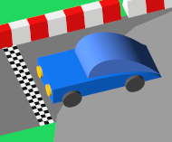
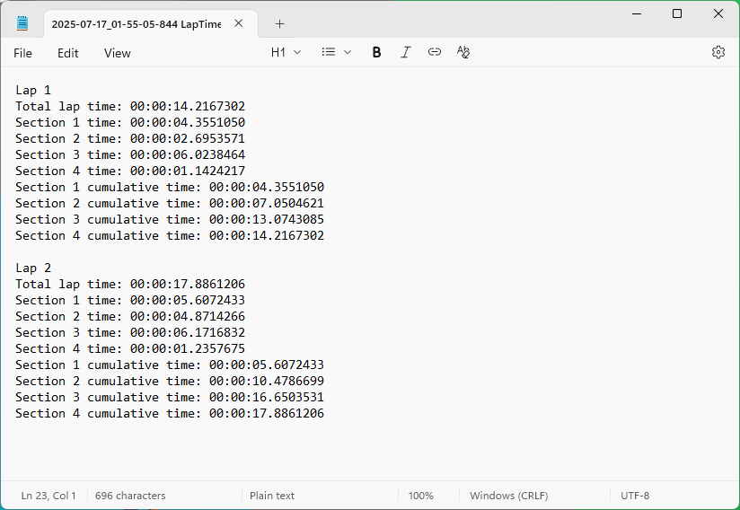

# How to build and run

1. Download this Git repository.
2. Install and open Unity Hub.
3. Install the Unity version specified in this file: [TriangleTT/ProjectSettings/ProjectVersion.txt](TriangleTT/ProjectSettings/ProjectVersion.txt).
4. In Unity Hub, click "Add", then "Add project from disk", then select the `TriangleTT` subfolder of the Git repository.
5. Open the project that was just created.
6. In Unity Editor, with the project opened, press "Ctrl+B".
    * This is a shortcut for "Build And Run".
7. Create a new folder for the project to be built in and continue.
    * The Unity Editor should show a dialog showing build progress.
    * It should take less than a minute to build.
    * Once the build completes, the game should automatically open.
8. To run the game, double-click the `TriangleTT.exe` file in the build folder.

# Controls

__Keyboard__

Accelerate: WASD  
Switch car: Q and E  
Reset car: R  
Navigate the UI: Mouse  

__Controller__

Accelerate: Left or right stick  
Switch car: D-pad left and right  
Reset car: X on Xbox, □ on PlayStation, Y on Switch  

# Tips and tricks

* To record a lap time, you must hit the checkpoints (white lines) in order: 1) checkered line, 2) blue turn checkpoint, 3) red turn checkpoint, and 4) yellow turn checkpoint.
* The green car is the only car with a max velocity.
* Master the standard cars (green, blue, red) before the special cars (yellow, cyan, magenta).
* Use a controller instead of a keyboard for smoother driving.
* Try left and right sticks to see which is easier to control.
  * As a right-handed person, I found using the right stick easier than the left stick.
* Check out the cars' stats by reading [`Garage.json`](TriangleTT/Assets/StreamingAssets/Garage.json).
* You can modify the cars' stats by editing the `Garage.json` in your build folder.

# Screenshots

# License

Everything in the repository is licensed under GPL-3.0-or-later.

# Misc

Before committing, do the following:
* Run the game in the editor player.
* Run the exported game by clicking "File/Build and Run" or Ctrl+B.
  * The export build process might change some non-gitignored files. These changes are build artifacts that are mixed in with non-build-artifact files. This is a known issue. However, these changes should still be committed.

